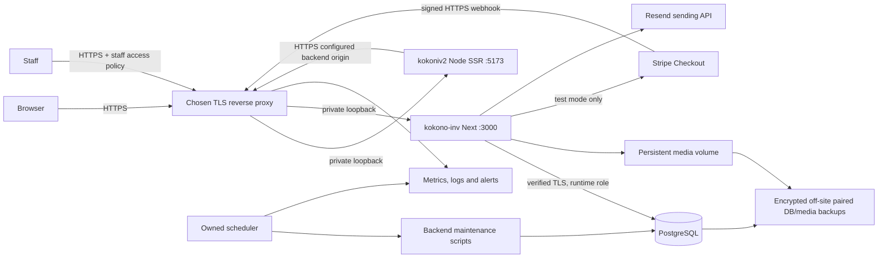

# Deployment, migration and staging runbook — Prompt 23

No production deployment was performed. No hosting provider or final domain was established. The files under `deploy/` are a **reviewable single-host Linux/nginx/systemd reference**, not a claim that these services exist or are installed. If managed hosting/containers are chosen, adapt listener/network, scheduling, secret injection and persistence controls, then repeat the same tests. Do not deploy the development-only `compose.yaml` as a production database.

## Topology and exact matching values



Choose public hostname **S** and backend/admin hostname **A**, then replace all `.example` values:

- Website `SITE_ORIGIN=S`; backend `STOREFRONT_BASE_URL=S`; optional backend `SITE_ORIGIN=S`. Same scheme, hostname and port, no path/query/credentials. These determine canonical, callback, email-link and mutation origins.
- Website `COMMERCE_API_ORIGIN=A`; backend `BETTER_AUTH_URL=A`. The server-to-server connection must verify A's HTTPS certificate. No general backend or admin route is proxied through the customer namespace.
- The exact gateway secret must match both processes. It never enters the browser. Cookies stay host-only in their own customer/admin realms; there is no shared parent-domain cookie or cookie Domain setting.
- Media remains on the backend's mounted runtime volume and is served through approved public image IDs. There is no separate media domain/provider to configure today.
- Webhook URL is **A + `/api/commerce/webhooks/stripe`**. Because A is undecided, an exact production FQDN cannot honestly be supplied. This path must bypass customer/staff interactive access challenges and preserve raw body/signature headers. All other admin access must retain its staff policy.

### TLS/proxy acceptance

1. Issue certificates for S and A; configure renewal alerts and redirect HTTP to the same approved HTTPS hostname. Restrict unknown hosts. Only the proxy listens publicly; firewall backend/website listeners and the DB to intended callers.
2. Configure the proxy's canonical Host and HTTPS forwarded protocol. It must **overwrite** X-Forwarded-For and Forwarded rather than append untrusted browser values. The application does not choose canonical URLs/upstreams from incoming Host headers.
3. With the new `TRUSTED_PROXY_IPS`, list only literal IPs of the immediately connected proxy. Without this, application client throttles treat proxy traffic as one peer. With it, only a matching socket peer plus a single valid IP header is trusted. Do not enter `*`, a public client address, arbitrary CDN headers or an unreviewed proxy chain.
4. In the nginx reference, the immediate peer is loopback and its X-Forwarded-For is overwritten with nginx's actual TCP peer. If another CDN sits in front of nginx, configure that trusted chain separately; this example does not authenticate CDN-supplied IPs. Test forged headers from both direct/untrusted and proxy paths.
5. Production `npm start` for the website rejects HTTP site or backend origins. Test helpers have an explicit programmatic loopback-only exception; there is no CLI production bypass. HTTPS customer cookies must be Secure, HttpOnly, SameSite=Lax and `__Host-`, with no Domain. Verify internal login behind the actual proxy too.
6. Check response headers on HTML, errors and APIs. Baseline CSP restricts framing, objects and base URLs without breaking current inline SSR/Next code. A nonce-based script CSP is additional work: do not claim the current CSP eliminates every XSS vector. Resend requires no browser domains; hosted Stripe Checkout navigates externally rather than embedding Stripe.js.
7. The reference starts HSTS at one day without includeSubDomains/preload. Increase only after all relevant hosts/TLS/renewal paths are verified. Certificate rotation, HTTP redirects and Secure cookies require external staging evidence.

`deploy/nginx.conf.example` supplies anonymous-read/auth rate and connection limits and sanitized access-log fields. It deliberately denies unconfigured staff routes. It is **not installed**, and rate values need load validation on the chosen host. Validate with `nginx -t`, load on protected staging, verify 429/Retry behavior, then check ordinary page/image/auth/reveal requests still work. Direct backend public endpoints must pass through equivalent controls; protecting only the website leaves a bypass.

## Runtime and database

Both packages require Node >=22.18.0. This phase ran Node **24.14.0**, npm **11.9.0**, PostgreSQL **18.3 UTF8**. Use lockfiles and pin the chosen runtime/container digest in CI/deployment; there is no packageManager pin in either package. Test a supported patched runtime/database release before rollout instead of assuming the local version is the newest. The repository's local PostgreSQL image is 18.3. PostgreSQL's current release page lists newer patches; release qualification is still needed, not an automatic untested image change. [PostgreSQL release information](https://www.postgresql.org/support/versioning/).

NFKC SQL normalization requires UTF8. Current migrations use PostgreSQL-specific functions, checks and triggers; the tested target is PostgreSQL 18, not SQLite/MySQL or an assumed older managed PG version. Confirm provider support and migration execution in staging. No `pg_trgm` extension was installed. B-tree indexes do not solve leading-wildcard NFKC search; searchable facet selectors and expression/trigram indexing remain measured follow-ups.

Current DB factory uses **10 connections per application process**, 5-second connection timeout and 30-second idle-pool timeout. Jobs are separate processes and add pools; the frontend has no DB pool. Budget `10 × backend replicas + concurrent job pools + migration/backup/ops headroom` against provider max_connections. Local max_connections is 100. Interactive read transactions usually default to 5 seconds; dashboard uses 15 seconds; gacha/complex commands use explicit longer limits. No transaction timeout was increased to conceal query work.

Set and verify PostgreSQL TLS with `sslmode=verify-full` and the provider's CA if needed. The production preflight rejects a URI without verified TLS. It does not itself prove the socket uses TLS; inspect `pg_stat_ssl` and test wrong-host/untrusted-certificate failure. Do not disable certificate verification globally.

Local DB inspection found SSL off, unlimited statement/idle-in-transaction timeout and a superuser role. These are development settings, not a production recommendation. Start staging with a reviewed runtime `statement_timeout` (e.g. 60 s) and `idle_in_transaction_session_timeout` (e.g. 60 s), `lock_timeout` (e.g. 5 s), then test the largest supported commands. Migration/backup roles need their own limits. Prisma interactive deadlines are distinct from PostgreSQL statement timeouts and pool waits.

### Role design and grants

Create passwords outside SQL/source/CI logs. Role names below are proposed exact operational names; adjust only as a coordinated deployment decision.

| Role | Ownership / permissions |
|---|---|
| `kokoni_migrator` | LOGIN, no superuser/CREATEDB/CREATEROLE/REPLICATION/BYPASSRLS. Own application schema/tables/functions and run versioned migrations. Database creation/extensions remain provider-admin work. Used only by release job, never by long-running app. |
| `kokoni_runtime` | LOGIN with CONNECT, schema USAGE, application table SELECT/INSERT/UPDATE/DELETE, sequence USAGE/SELECT and application-function EXECUTE. No schema ownership/CREATE, no TRUNCATE, no migration-table access or extension/role/database creation. Existing immutable-history triggers still enforce allowed DML. |
| `kokoni_backup` | Restricted backup identity with CONNECT/USAGE/SELECT on backed-up application data, including private auth records when producing full recovery backups; no application writes. Provider physical/PITR backups use their documented service privileges. Treat backup access as sensitive. |
| `kokoni_ops_readonly` | CONNECT/USAGE and explicitly chosen operational tables/views only. Do not blindly grant customer password/session/token data to a reporting user. No writes. |

After the provider creates DB/roles, run the following reviewed grants in `kokoni` using schema owner credentials (SQL commands, **not a script installed by this audit**):

```sql
REVOKE CREATE ON SCHEMA public FROM PUBLIC;
GRANT CONNECT ON DATABASE kokoni TO kokoni_runtime, kokoni_backup, kokoni_ops_readonly;
GRANT USAGE ON SCHEMA public TO kokoni_runtime, kokoni_backup, kokoni_ops_readonly;
GRANT SELECT, INSERT, UPDATE, DELETE ON ALL TABLES IN SCHEMA public TO kokoni_runtime;
REVOKE ALL ON public._prisma_migrations FROM kokoni_runtime;
GRANT USAGE, SELECT ON ALL SEQUENCES IN SCHEMA public TO kokoni_runtime;
GRANT EXECUTE ON ALL FUNCTIONS IN SCHEMA public TO kokoni_runtime;
GRANT SELECT ON ALL TABLES IN SCHEMA public TO kokoni_backup;
ALTER DEFAULT PRIVILEGES FOR ROLE kokoni_migrator IN SCHEMA public
  GRANT SELECT, INSERT, UPDATE, DELETE ON TABLES TO kokoni_runtime;
ALTER DEFAULT PRIVILEGES FOR ROLE kokoni_migrator IN SCHEMA public
  GRANT USAGE, SELECT ON SEQUENCES TO kokoni_runtime;
ALTER DEFAULT PRIVILEGES FOR ROLE kokoni_migrator IN SCHEMA public
  GRANT SELECT ON TABLES TO kokoni_backup;
```

Recheck grants after migrations. Runtime UPDATE is needed for stock/reservations/order statuses and SELECT FOR UPDATE; grants do not replace the domain/trigger invariants. Do not grant TRUNCATE, disable triggers, or use `session_replication_role=replica`. Decide CONNECT/TEMP revocation from PUBLIC with provider/admin needs in mind. Set fixed schema/search_path and protect role passwords. Verify the runtime cannot CREATE TABLE, ALTER/DROP objects or read `_prisma_migrations`; exercise actual commands under that role. The local restore drill tested non-owner DML, denied DDL and denied ledger rewrite; deployment grants themselves remain unconfigured.

## Migration inventory and recovery

`npx prisma migrate status` and `npx tsx scripts/audit-database.ts` were run read-only. **All 16 applied local migrations matched their recorded checksums.** The seventeenth is pending locally. No production database was supplied, so its applied state is unknown.

| Ordered migration | Local state | Review point |
|---|---|---|
| `20260907144108_core_domain` | Applied | Base tables, FKs and indexes; empty-database initialization |
| `20260907145000_domain_constraints` | Applied | Ledger immutability and hierarchy constraints/triggers |
| `20260907154208_lineup_sources` | Applied | Source/provenance relations |
| `20260907170000_item_release_date` | Applied | Partial date fields and validation |
| `20260907213000_inventory_management` | Applied | Inventory constraints and partial acquisition index |
| `20260907230000_watchlist_geography` | Applied | Location geography/backfill; review unknown country records |
| `20260908120000_purchasing_records` | Applied | Purchase and receipt FKs/integrity |
| `20260908140000_international_shipments` | Applied | Shipment/transit/audit relations |
| `20260908160000_landed_costs` | Applied | Immutable costing/allocation history |
| `20260908180000_marketplace_candidates` | Applied | Candidate/conversion relations |
| `20260908190000_storefront_publication` | Applied | Public taxonomy/image mappings and backfill; review existing category/image approvals |
| `20260909120000_customer_checkout` | Applied | Orders/payments/reservations/fulfillment and stock guards |
| `20260909140000_gacha_domain` | Applied | Changes shared reservation ownership to order OR gacha; old clients assuming non-null order ownership are incompatible |
| `20260910120000_customer_accounts` | Applied | Separate customers and nullable historical order ownership; no automatic guest-email claim |
| `20260911120000_customer_gacha` | Applied | Customer execution/allowances/rewards/audit constraints |
| `20260912120000_gacha_fulfillment` | Applied | Reward states/claims/fulfillment; legacy handovers preserved |
| `20260913120000_audit_query_indexes` | **Pending** | Two ordinary CREATE INDEX statements on movements and rewards; may block writes on populated tables |

These are not all trivially reversible: later migrations add/replace constraints, transform/backfill fields and change supported reservation ownership. No automatic down-migration/Prisma reset strategy is appropriate. Review SQL and counts on a restored snapshot, drain old workers, back up, migrate forward, then deploy compatible clients. Timestamp ordering is consistent even though some names were assigned ahead of the local calendar day. Do not rename applied migrations or rewrite checksums.

### Exact index deployment alternatives

For a new/empty database or a planned write-maintenance window, apply the existing migration unchanged:

```sh
npx prisma migrate status
npm run db:deploy
npx prisma migrate status
```

For a large populated database with no write window, **only after verifying all earlier migrations applied and this is the sole pending migration**, a DBA can perform this alternative outside a transaction using the migration/owner role:

```sql
CREATE INDEX CONCURRENTLY inventory_movements_created_at_id_idx
  ON public.inventory_movements(created_at DESC, id DESC);
CREATE INDEX CONCURRENTLY gacha_rewards_merchandise_item_id_idx
  ON public.gacha_rewards(merchandise_item_id);
SELECT c.relname, i.indisvalid, i.indisready, pg_get_indexdef(i.indexrelid)
FROM pg_index i JOIN pg_class c ON c.oid=i.indexrelid
WHERE c.relname IN ('inventory_movements_created_at_id_idx',
                   'gacha_rewards_merchandise_item_id_idx');
```

Verify both exact definitions, schema, readiness and validity; only then record that **the existing migration's complete effects** have been applied:

```sh
npx prisma migrate resolve --applied 20260913120000_audit_query_indexes
npx prisma migrate status
```

Do not run `resolve` merely to silence a failed deployment. Failed concurrent builds can leave invalid indexes; inspect, drop only the specifically failed owned index with a reviewed concurrent operation, and retry. Do not use `IF NOT EXISTS` as proof of correctness. Ordinary index creation blocks writes; concurrent builds cannot run in a transaction and have additional recovery considerations. [PostgreSQL CREATE INDEX documentation](https://www.postgresql.org/docs/current/sql-createindex.html).

No index migration history was edited. An additional candidate image index was experimentally ineffective and was **not** promoted to a migration. Use `migrate deploy`, never `db push`, to reconstruct the schema/triggers.

## Clean build and process management

Build a fresh release directory from reviewed code/lockfiles on the target OS/architecture. Do not run `npm ci` over a serving release. Sharp is now an explicit pinned production dependency (already present transitively through Next); native binaries must match the deployment platform. No custom image decoder was written.

Backend, with intended build/test environment injected:

```sh
npm ci
npm run db:validate
npm run typecheck
npm run lint
npm test
npm run build
```

`npm run build` already generates Prisma. Tests require a separate `_test` DB and create owned schemas; omit the test DB from production runtime, not from CI. Before migration, supply `DATABASE_URL` for the migration role to the migration command alone. Runtime uses the runtime role. Do not run production demo seed.

Website:

```sh
npm ci
npm run build
npm test
npm start
```

Build includes TypeScript, Vite client and SSR outputs. The deployable unit includes `server.mjs`, root gateway/config modules, `dist/client`, `dist/server`, production dependencies and injected server settings. **Static Vite hosting alone is insufficient** for auth, SSR, cart resolution and checkout gateways. Do not use `vite preview` as this application's production runtime.

The reference services run Node directly, restart on failure and use fixed private listeners. The backend unit runs preflight first. Prepare `.next/cache` and media paths with correct ownership. Both processes log to the journal. The website now stops accepting new connections, drains active work up to 45 seconds, then closes stragglers; supervisor stop timeout is 50 seconds. Next handles its own signal path; verify shutdown during quote/pull requests on staging. Never restart by indiscriminately killing every Node process.

The reference keeps `tsx` available for TypeScript operations scripts. It is currently a development dependency, so an `npm ci --omit=dev` runtime image would break these jobs/preflight unless you separately compile/package them. Use the reviewed full locked installation for this reference or prepare a tested operations image. Do not silently omit operational dependencies.

## Deploy order and rollback

1. Choose S/A/provider, isolated staging and production DBs, named owners, monitoring destination and staff access policy.
2. Provision least-privilege roles, verified database TLS, durable media, secret injection, TLS proxy/firewall, backup destination and alert channel.
3. Produce and restore-test a paired backup. Drain writes/jobs; ensure old incompatible processes cannot resume after schema changes.
4. Build both immutable release directories with locked dependencies; run tests. Verify production configuration with `NODE_ENV=production npm run ops:preflight` using the chosen runtime environment (PowerShell: set `$env:NODE_ENV='production'` first).
5. Apply reviewed migrations with migration credentials; verify checksums/index validity and grant defaults. Switch back to runtime credentials.
6. Start backend; verify `/api/health` and `/api/ready`, media read/write, internal login and runtime-role restrictions. Start the website's **Node SSR** process; verify `/healthz`, `/readyz`, SSR product HTML and public-safe API output.
7. Install chosen scheduler/timers and backup jobs; observe actual successful runs and deliberately test alerting on a controlled failure. Install/validate edge rate limits; verify trusted proxy handling and security headers over HTTPS.
8. Provision the one-time administrator; configure real storage geography/fulfillment flags, public categories, approved media and one reviewed test listing. Do not bulk-publish first.
9. Complete external email and Stripe TEST verification and the continuous staging scenarios in [runbooks.md](runbooks.md). Check concurrent behavior, cookies, restart/media persistence and recovery using staging inventory only.
10. Keep live money/paid gacha disabled. Resolve every launch blocker in [production-readiness.md](production-readiness.md), then explicitly authorize the appropriate traffic/features.

Rollback first stops new checkout/draw traffic using existing flags and edge maintenance access while preserving recovery/ownership. Roll back app artifacts only to a version compatible with the deployed schema. Do not reverse gacha reservation changes with an older client. Reverting a DB to a backup can erase new payments/awards: reconcile external provider events and inventory before accepting traffic. Pair DB rollback with the corresponding media/config release; preserve newer backup evidence. Prefer forward corrective migrations. There is no guaranteed one-command rollback for all 17 migrations.

## Data and first publication

Provision admin via `scripts/provision-internal-user.ts` using short-lived PROVISION_* environment values; no default password exists and no public signup endpoint can create an admin. The schema requires 12–128 characters; use a password manager and remove bootstrap secrets immediately. Existing accounts are not overwritten. Keep the trusted CLI available only to operators; do not publish it as an HTTP endpoint. Confirm the intended one-owner model before adding staff; broad internal capabilities are still present. MFA/access proxy or VPN is recommended for the admin host; granular RBAC is separate work.

Create locations using the admin UI: Japan with JP and fulfillment disabled; transit disabled; France root with FR, active ancestry, and explicit fulfillment enabled on the actual balance location, including a shelf/box if used. Names alone do not qualify stock. Review generic warehouse country metadata. Public categories are created by migrations; map actual internal categories deliberately. Configure valid TTC EUR listing prices and selected approved images. Publish one test item with France stock, check its public DTO and website availability, unpublish (404), then republish before bulk launch. Re-ingest corrupted legacy images through the new strict pipeline; do not merely mark them approved.
